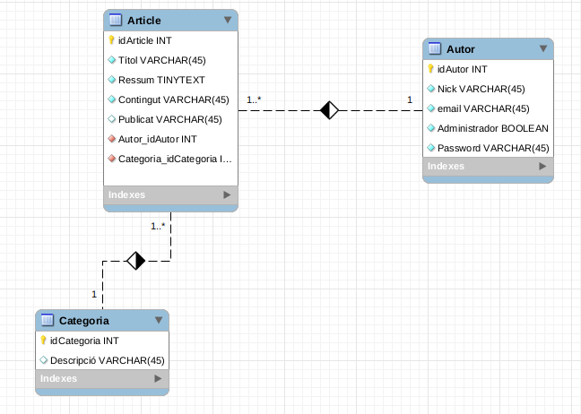
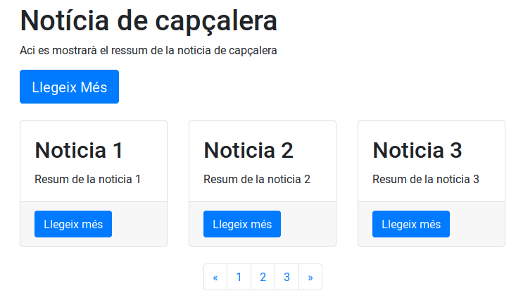
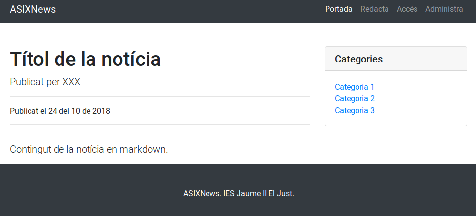
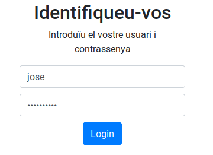
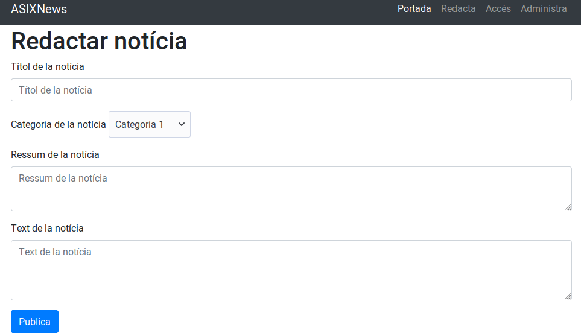
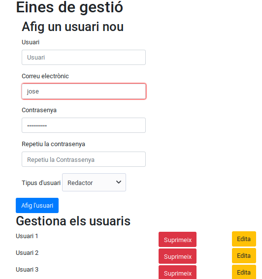

# ASIXNews

## Especificació del projecte ASIXNews

### 1. Introducció

* **Títol del projecte**: ASIXNews
* **Objectius**: 
  * Desenvoupar una aplicació de gestió de notícies amb múltiples editors.
* **Descripció**: El projecte d'exemple que plantegem, ASIXNews és un menut sistema de gestió de continguts orientat a la redacció de notícies per part de múltiples usuaris.
* **Desenvolupador**: @joamuran
* **Adreça web en Github:** https://github.com/2ASIX2018/ASIXNews

### 2. Disseny

L'aplicació farà ús principalment de dues taules a la base de dades, per tal de gestionar notícies per una banda, i per altra la gestió dels usuaris.

#### 2.1. Descripció de la base de dades

L'esquema de la base de dades és la següent:

#### 2.2. Descripció de la interfície 

Les diferents pàgines de què es composarà l'aplicació seran:

* **Pàgina inicial**: Mostra les últimes notícies publicades, amb el títol, l'editor i el ressum de la notícia, més un paginador per accedir a notícies antigues.

* **Post**: Quan fem clic a "Llegeix més", de la pàgina principal, accedim a una pàgina on es mostra la notícia completa. També disposarem d'un buscador per categoríes de notícies.

* **Formulari d'accés**: Quan un usuari registrat vol accedir a l'aplicació, ho farà a través del següent formulari:

* **Redacció de notícies**: Els usuaris registrats podran redactar notícies a partir del següent formulari. Per tal de formatar les notícies, farem ús de sintaxi Markdown.

* **Pàgina d'Administració**: L'usuari administrador podrà gestionar els diferents usuaris a través de la següent pàgina d'administració:

### 3. Tasques a realitzar i calendarització

| Tasca | Dates de realització |
|------|-------------|
| Creació de les diferents vistes |  |
| Modularització de | |
| Integració del control de sessions | |
| Creació de la base de dades | |
| Afegir funcionalitat d'obtenir notícies | |
| Afegir funcionalitat de redactar notícies | |
| Afegir funcionalitat per gestionar usuaris | |
